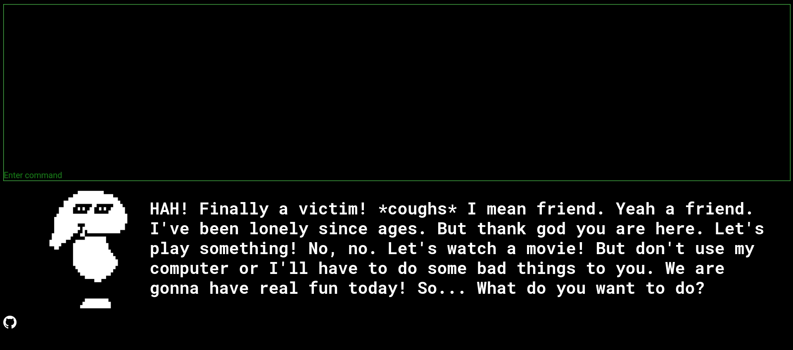

# Bash the Dummy!

This project is a very basic, text based javascript game that developed for the `BTU BLM0226 Web Tabanlı Programlama` class.

## Story

Dummy is very lonely and a great friend. So he made sure that if someone logs into his computer, (s)he would never be able to get out. So, are you going to stay with him or try to break out with your `bash` skills?  

Dummy is heavily inspired from the [Mad Dummy](https://undertale.fandom.com/wiki/Mad_Dummy) from [Undertale](https://undertale.com/). But now, he is friendly and still a bit mad too!

## How to play?

There is a freely hosted web server that you can directly play: [Bash the Dummy!](http://bashthedummy.coolpage.biz/)  

But if you want to play it locally:

1. Download this repository
2. Open a http server in downloaded repository (if you have `python` installed, you can type: `python -m http.server`)
3. And go to `localhost:[PORT]` at your browser

## Known bugs, available commands and walkthrough

#### Known bugs:

* Terminal is `bash` based but still some of the `bash`'s functions may not work.
* File paths are not real. And there are no real files either. If you invoke a command, it checks for some conditions and does it's magic on imaginary files and paths.
* Because file paths are not real, relative file paths may not work as expected.
* There are no flag options for any program.
* At first start, there is no prompt like `[dummy@greatdummyspc / ] $`. You need to enter your first command to see that.

#### Available commands:

If you don't know bash or just wanted to learn what commands are available, check [this](available_commands.md).

#### Walkthrough:

If you couldn't beat the game, you can check [walkthrough](walkthrough.md).

## Resources

* Terminal: heavily modified version of [webdevtrick's terminal implementation](https://webdevtrick.com/javascript-terminal-emulator/)
* 8 bit images: [make8bitart](https://make8bitart.com/)
* Music: [Groovepad](https://play.google.com/store/apps/details?id=com.easybrain.make.music&hl=en_US&gl=US)

## License

[GNU General Public License v3.0](LICENSE)
