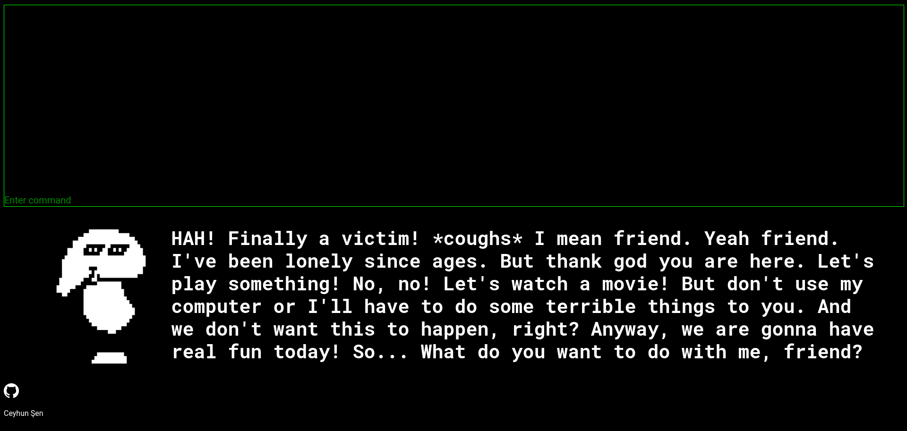

# Bash the Dummy!

This project is a very basic javascript game that developed for the BTU BLM0226 Web Tabanlı Programlama class.

## Story

Dummy is very lonely and a great friend. So he made sure that if someone logs into his computer, (s)he would never be able to get out. So, are you going to stay with him or try to break out with your `bash` skills?  

Dummy is heavily inspired from the [Mad Dummy from Undertale](https://undertale.fandom.com/wiki/Mad_Dummy).

## How to play?

There is a freely hosted web server that you can directly play: [Bash the Dummy!](http://bashthedummy.coolpage.biz/)  

But if you want to play it locally:

1. Download this repository
2. Open [index.html](index.html) on your browser
3. OR open a http server in that location and go to `localhost:[PORT]` at your browser

## Resources

* Terminal: heavily modified version of [webdevtrick terminal implementation](https://webdevtrick.com/javascript-terminal-emulator/)
* 8bit art: [make8bitart](https://make8bitart.com/)
* Music: [Groovepad](https://play.google.com/store/apps/details?id=com.easybrain.make.music&hl=en_US&gl=US)

## License

[GNU General Public License v3.0](LICENSE)
